# Accelerating Development with Gemini CLI

## Overview

This lab focuses on utilizing Gemini CLI, an open-source AI-powered agent in Google Cloud. You will learn to use Gemini CLI for various tasks, including understanding existing codebases, generating documentation and unit tests, refactoring both UI and backend components of a Python web application, and deploying the application to Cloud Run.

### What you will learn

In this lab, you will learn how to do the following:

* How to use Gemini CLI to boost productivity for common Developer/Platform Engineering tasks.

### Prerequisites

* This lab assumes familiarity with the Cloud Console and Cloud Shell environments. We'll be using the Web Preview feature of Cloud Shell to easily test the application locally in the browser on a new tab. The Web Preview button appears on the top right end of the Cloud Shell:


## Download and examine the application


Run the commands below to clone the Git repository locally using the *copy to cloud shell* button above the following command chunk.

```bash
git clone https://github.com/kbhattac/calendar-app-lab
cd calendar-app-lab
```

## Gemini CLI Introduction


[Gemini CLI](https://github.com/google-gemini/gemini-cli/tree/main?tab=readme-ov-file#gemini-cli) is an open-source AI agent that integrates with Google Cloud's Gemini models. It allows developers to perform various tasks directly from their terminal, such as understanding codebases, generating documentation and unit tests, and refactoring code. The key benefit of Gemini CLI is its ability to streamline development workflows by bringing the power of generative AI directly into the developer's command-line environment, reducing context switching and enhancing productivity.

Check that you are in the root of the project folder `~/bootkon/calendar-app-lab`:

```bash
pwd
```

Start Gemini CLI in the terminal window:

```bash
gemini
```

Your environment should look similar to the screenshot below.

You can enable integration with your IDE and change this by running `/ide disable | enable`.

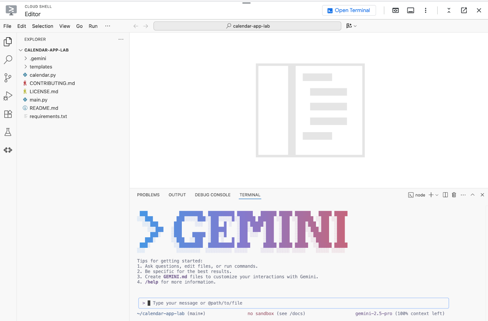


To check the Gemini CLI installation details, run following command:

```
/about
```

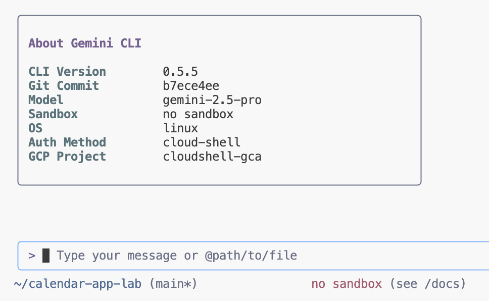


## Codebase understanding


You can use the Gemini CLI to quickly gain codebase understanding by asking it to summarize the purpose of files or directories and explain complex functions or sections of code. This allows developers to rapidly onboard to new projects or grasp unfamiliar parts of existing code without deep manual exploration.

To learn more about the codebase, send the following prompt in the Gemini CLI:

```bash
Don't suggest any changes. Explain this codebase to me.
```

Review the output:

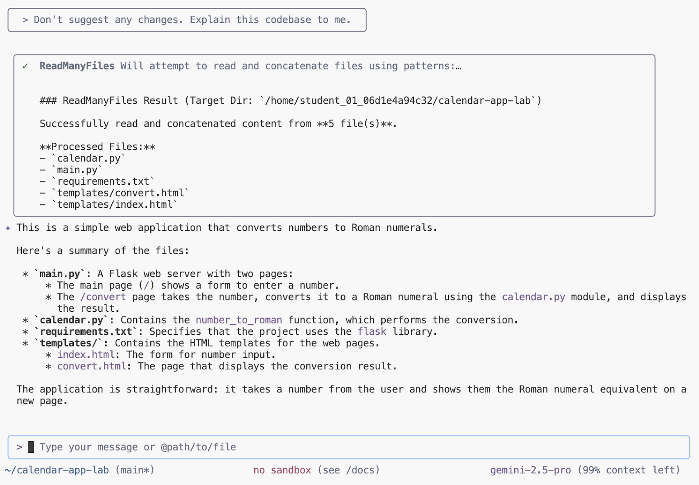


## Start the application locally


The Gemini CLI can significantly simplify running your Python application locally by helping you auto-generate essential configuration files like requirements.txt or a basic Dockerfile. Moreover, it's excellent for managing Python dependencies and troubleshooting, as it can quickly explain traceback errors resulting from missing packages or version conflicts, and often suggest the precise pip install command to fix the issue.

To launch the application locally, enter the following prompt in the Gemini CLI terminal:

```bash
Run this app locally in interactive mode
```

Follow the prompts to get application started:

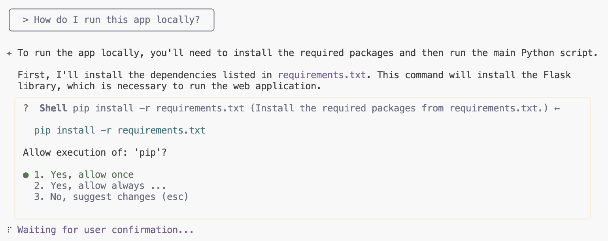

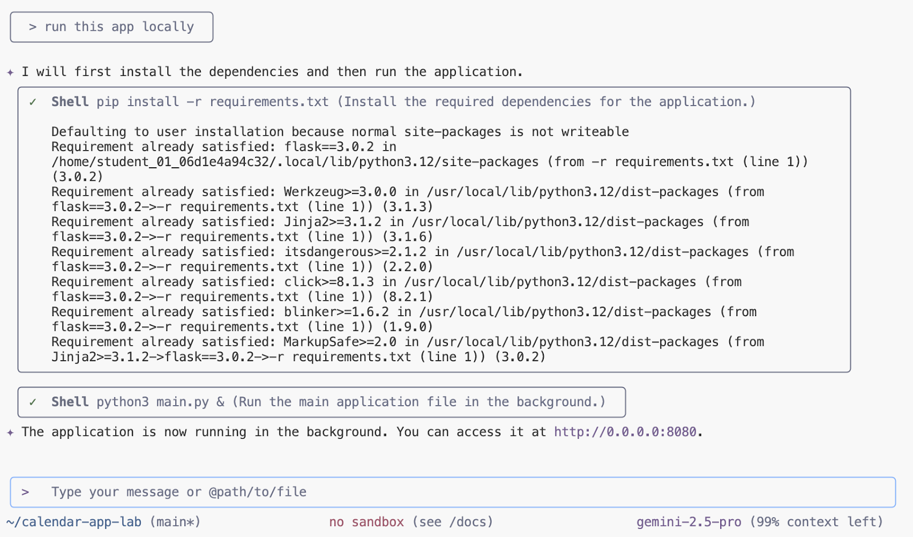

Click on the Web Preview button to check the app:

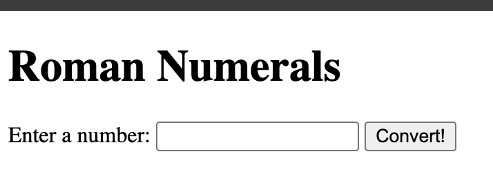

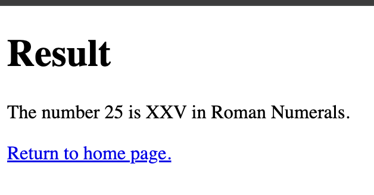

Close the Web Preview tab. Press `Ctrl+C` in the Gemini CLI window to quit the application running interactively and proceed with the lab.


## Adding documentation


The Gemini CLI is effective for documentation and commenting by allowing you to instantly generate docstrings for functions or classes. You can also leverage it to quickly add explanatory inline comments to complex or unfamiliar code blocks, significantly improving the codebase's clarity and maintainability.

To add comments to every Python file in the application, use the Gemini CLI terminal and enter the following prompt:

```bash
Add docstrings to all files
```

Approve the changes that have been suggested. If IDE integration is enabled, you can accept and proceed by using the UI controls or pressing Enter in the terminal. You can also enable auto-approve(YOLO) mode with "`ctrl+y`".

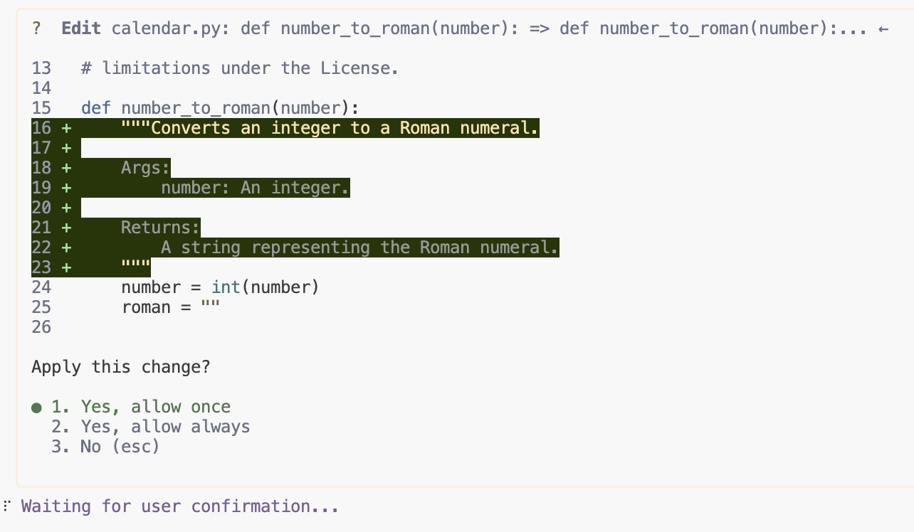

Update the `.gitignore` file with the following prompt:

```bash
update .gitignore and add __pycache__ folder
```

Switch to Source Control view and review changes that you made so far:

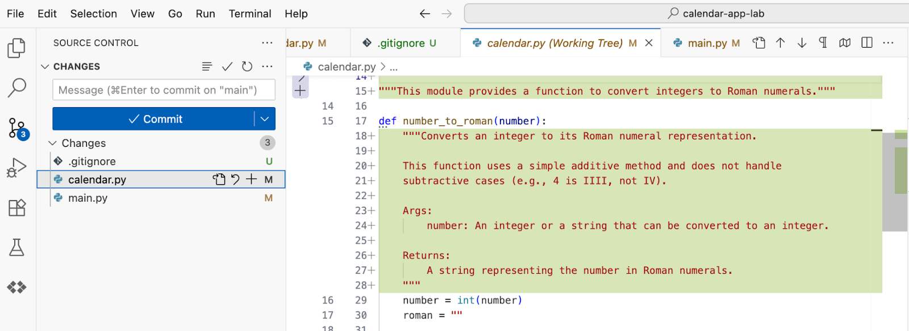


## Adding Unit Tests


The Gemini CLI is excellent for writing unit tests by enabling developers to generate test functions based on an existing function's signature and logic, complete with initial assertions and mock setup, developers must still review and validate the generated tests to ensure they meaningfully cover all required edge cases and not just simplistic path execution.

Using the prompt below, to generate unit tests:

```bash
Generate unit tests for @calendar.py
```

Accept the changes after reviewing them.

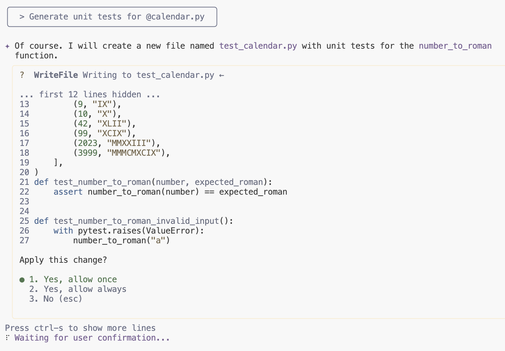

Install new dependencies and run the tests. The Gemini CLI will observe, fix, and re-run the generated code in a loop until tests pass and the code is validated.

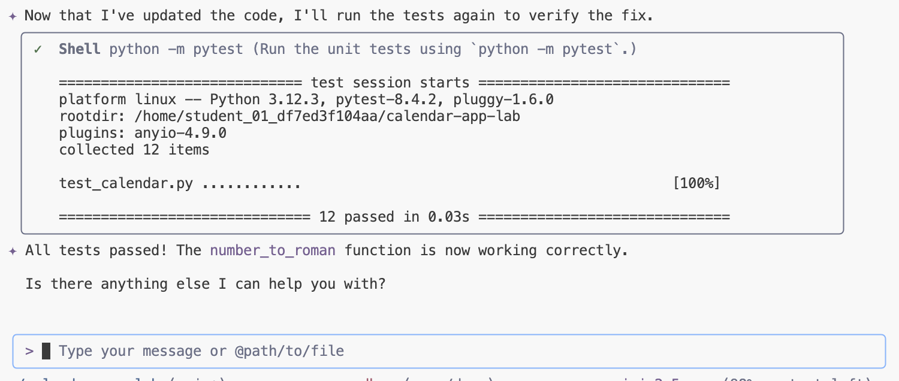


## Check for bugs


The Gemini CLI can assist in checking for bugs in the logic by enabling you to prompt it to review and analyze code snippets, identifying potential logical flaws, off-by-one errors, or incorrect conditional handling. By explaining the code's intended behavior and asking the CLI to spot discrepancies, you can quickly catch subtle defects before running the code.

To check for any bugs in conversion logic, send the following prompt in Gemini CLI:

```bash
Are there any bugs in the conversion logic? Check if negative numbers are handled properly.
```

Review suggested changes and accept them in the chat:

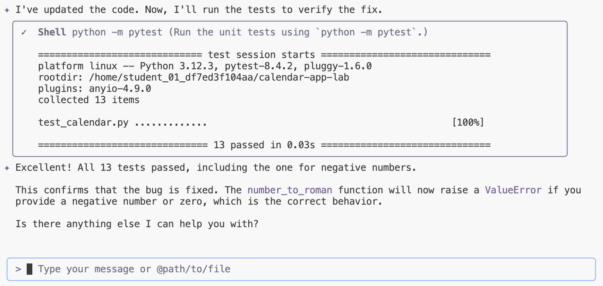


## Refactor UI


The Gemini CLI can significantly aid in UI refactoring by helping you translate older UI patterns (like class components) into newer, more modern functional paradigms (like hooks in React) or suggest structural improvements for better maintainability. You can use it to analyze and refactor existing UI code into more modular, reusable components, ensuring a cleaner and more standardized interface design.

Refactor the UI using the Bootstrap library by submitting the following prompt to the Gemini CLI:

```bash
Refactor UI to use Bootstrap library
```

Review and accept the changes:

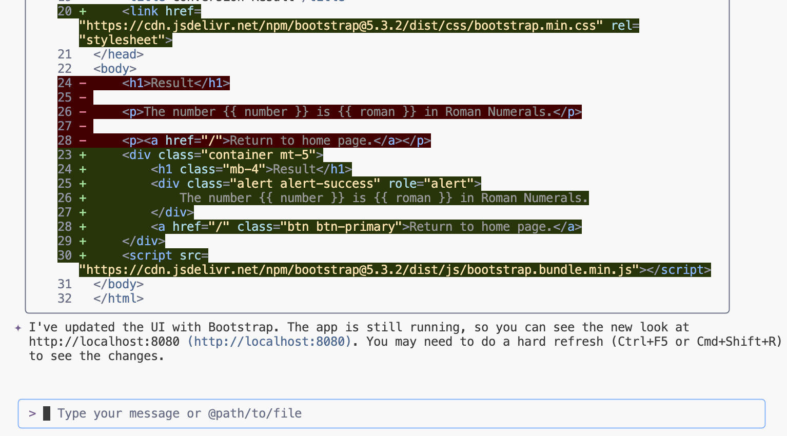

```bash
Run this app locally in interactive mode
```


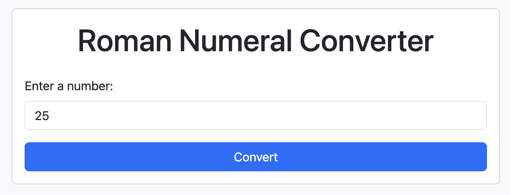


Close the Web Preview tab. Press `Ctrl+C` in the Gemini CLI window to quit the application and proceed with the lab.

Implement error handling to ensure an error page is displayed when issues arise.

```bash
Implement error handling to display an error page when issues occur.
```
Wait for Gemini CLI to finish. Test the application for the changes:

```bash
Run this app locally in interactive mode
```

Send a negative number to confirm the error page.

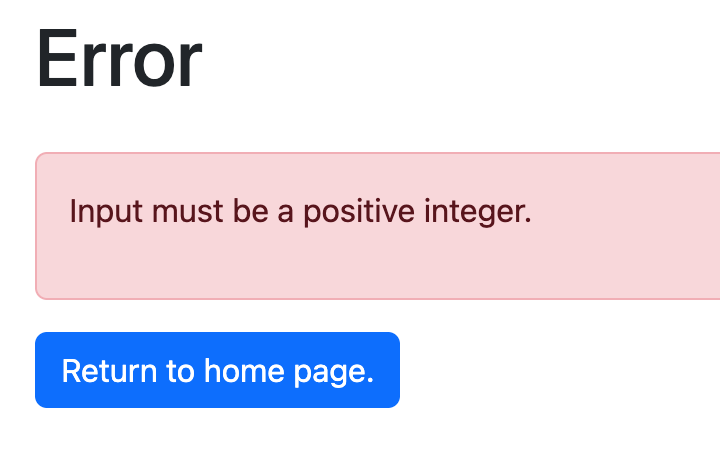

Close the Web Preview tab. Press `Ctrl+C` in the Gemini CLI window to quit the application and proceed with the lab.

## Refactor Backend


The Gemini CLI is effective for backend refactoring by assisting in the migration of legacy framework code to modern alternatives or helping restructure monolithic services into more manageable microservice components. It can analyze server-side logic to suggest improved database query patterns or more efficient API endpoint designs, ensuring performance and scalability are maintained or enhanced.

Modify the backend to save conversion requests in memory.

```bash
Store requests in memory and create a page to display conversion history. Add links on all pages to view the history.
```

Review and accept the changes in the chat:

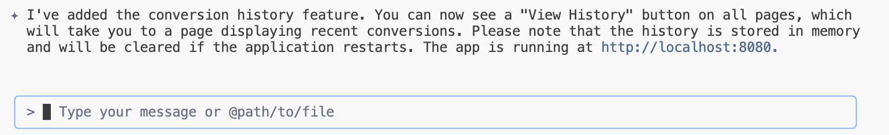

Check out the changes (use the Web Preview):

```bash
Run this app locally in interactive mode
```

Submit several requests to the application, then review history page.

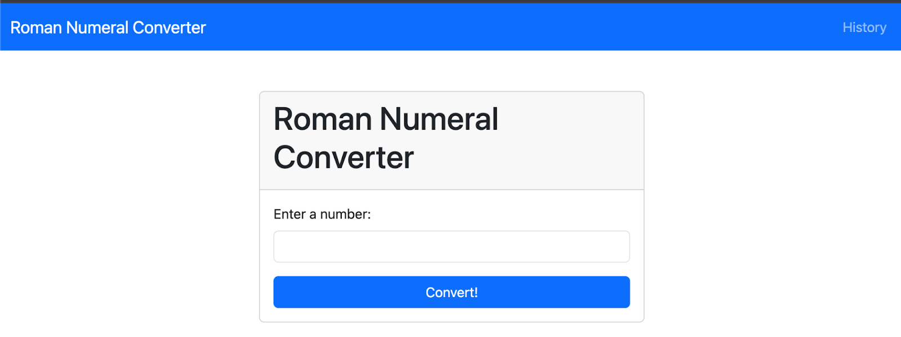

Review the history of conversion requests.


Close the Web Preview tab. Press `Ctrl+C` in the Gemini CLI window to quit the application and proceed with the lab.

To update the README.md file with the current codebase state, send this prompt via Gemini CLI:

```bash
analyze README.md file and update it with latest codebase state
```

Review the output. If you enabled Cloud Shell integration, you can use UI control to access the changes or you can do it from the terminal.


## Gemini CLI Built-in Tools


The Gemini CLI includes built-in tools that the Gemini model uses to interact with your local environment, access information, and perform actions. These tools enhance the CLI's capabilities, enabling it to go beyond text generation and assist with a wide range of tasks.

Send this prompt in Gemini CLI to view the available tools:

```bash
/tools
```

Review the output.

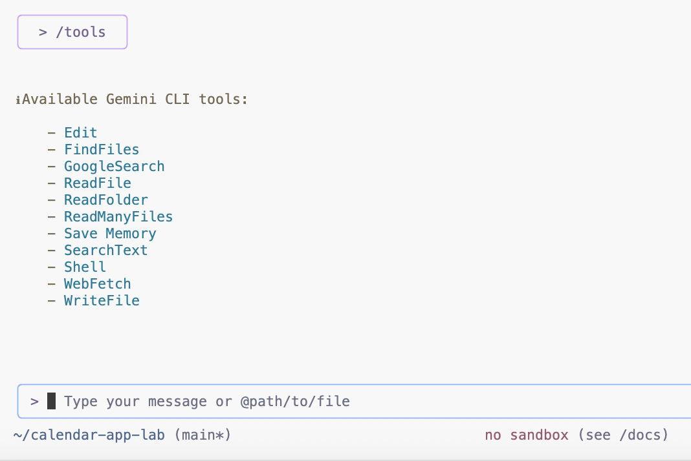

Gemini CLI intelligently selects the most appropriate built-in tools based on the task you provide, allowing it to execute complex operations by leveraging its understanding of your request and the available functionalities.  [Learn more about the built-in tools](https://github.com/google-gemini/gemini-cli/blob/main/docs/tools/index.md#learn-more-about-gemini-clis-tools).


## Gemini CLI Repo Init Command


The Gemini CLI includes a command to analyze the project and create a tailored GEMINI.md file.

To generate the **GEMINI.md** file, send the following prompt using the Gemini CLI:

```bash
/init
```

Review the output. This command will create a GEMINI.md file, which summarizes the project's purpose, technologies, build/run instructions, and development conventions for future context.

To understand what instructions or context to include in your project's `GEMINI.md` file, a good starting point is to review the GEMINI.md file found in the `gemini-cli`  [repository](https://github.com/google-gemini/gemini-cli/blob/main/GEMINI.md#avoiding-any-types-and-type-assertions-preferring-unknown).


## Gemini CLI Custom Commands


You can streamline your development workflow and maintain consistency by using custom commands in Gemini CLI. These commands act as personal shortcuts for your most-used prompts. You have the flexibility to create commands that are specific to a single project or make them globally available across all your projects.

The repository comes with several custom commands located in the `.gemini/commands` folder.

### Custom Command To Create a Diagram

Send this prompt in Gemini CLI to generate a request flow diagram in Mermaid format.

Accept tools calls, like creating a folder and saving a file.

```bash
/diagram:new request flow for this app
```

Review the output.

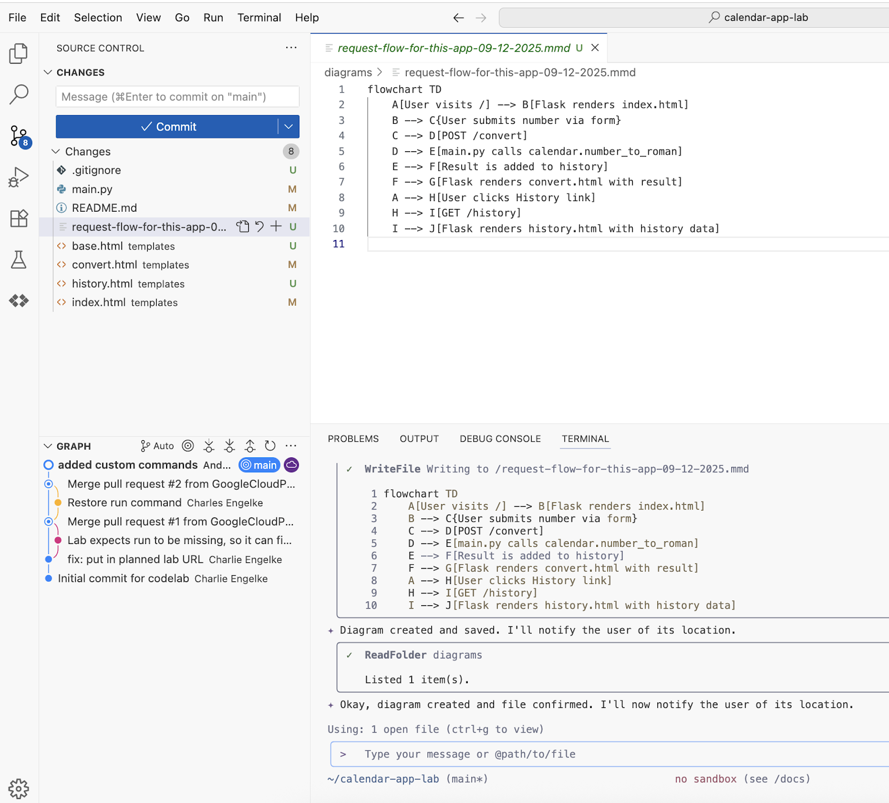

If you want to preview the diagram, install `Mermaid Chart` extension from the Marketplace.

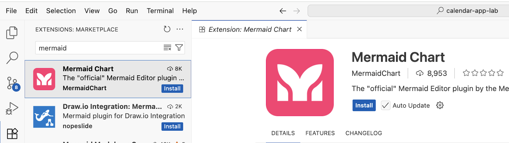

Open the file and select preview from the context menu.

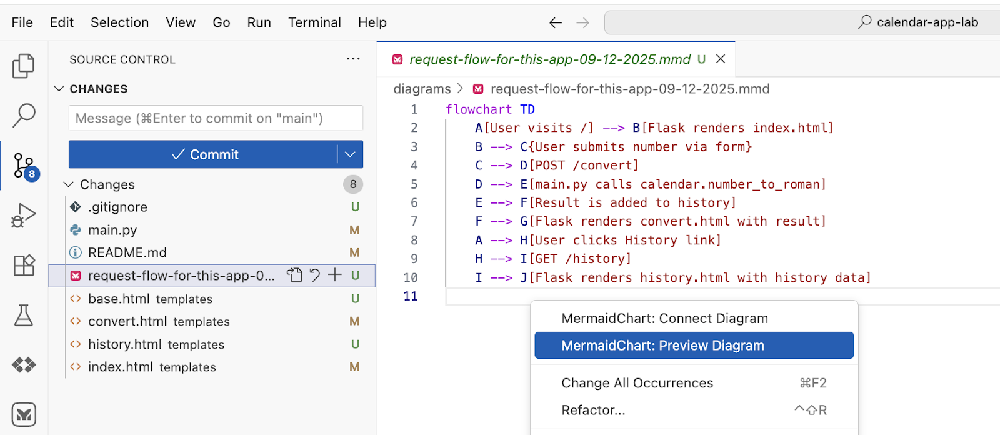

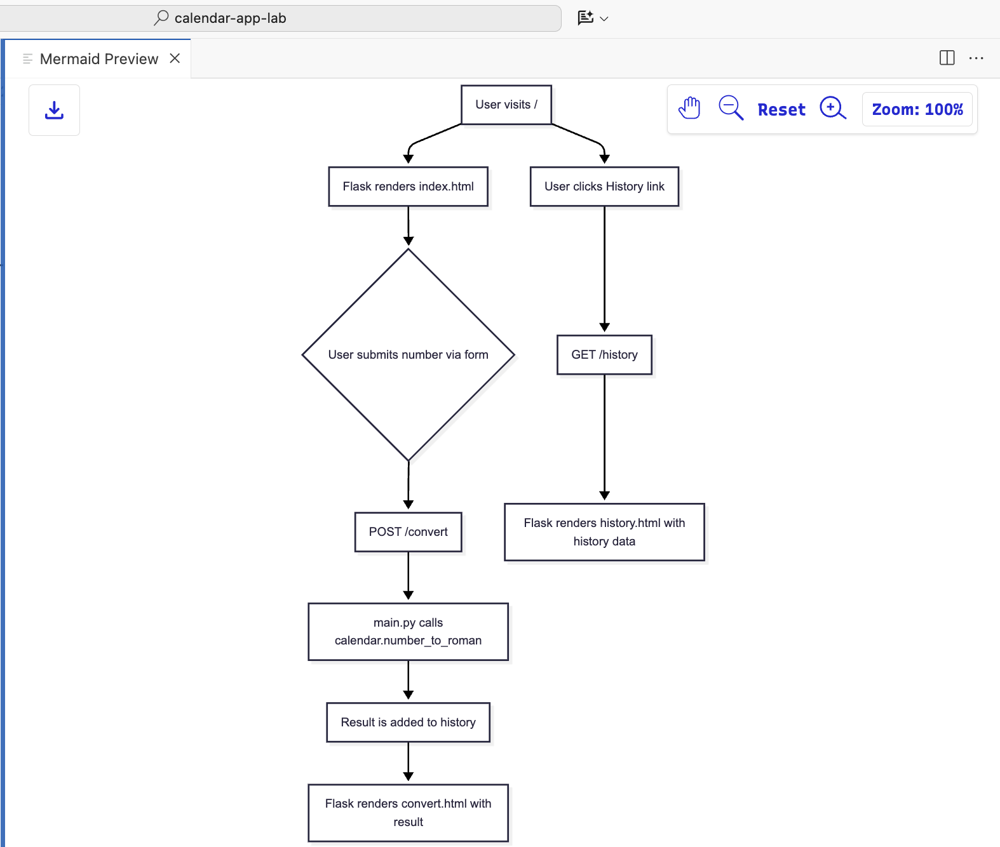


### Custom Command To Plan New Feature Implementation

Send this prompt in Gemini CLI to refactor UI.

Accept tools calls, like creating a folder and saving a file.

```bash
/plan:new refactor UI to use Materialize CSS
```

Review the output.

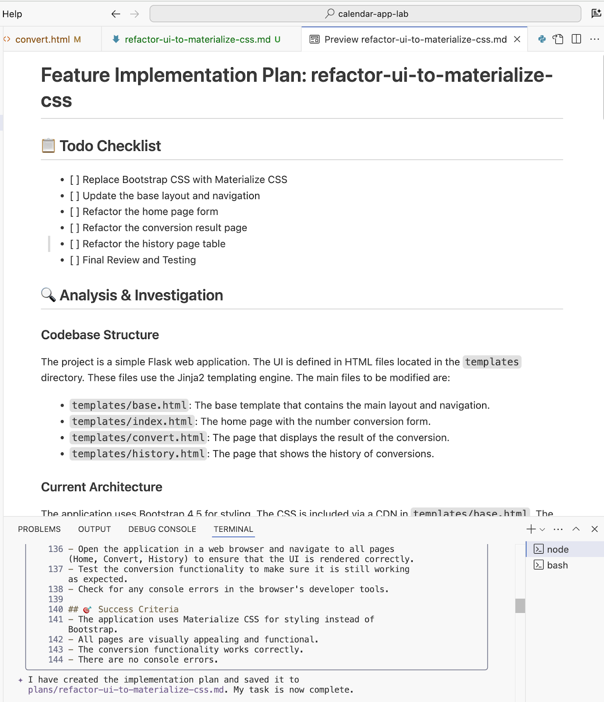

Initiate the UI refactoring process by submitting this prompt through the Gemini CLI, based on the previously generated plan.

Accept tools calls, like creating a folder and saving a file. You can enable tools auto-approve mode(`YOLO mode`) by using "`ctrl+y`".

```bash
/plan:impl implement the plan to refactor the app
```

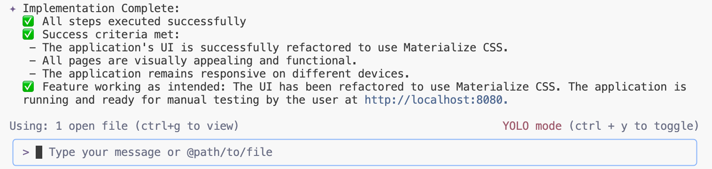

Start/reload the application and review the output: (tip use the prompt to run the app locally in interactive mode in Gemini CLI and use Web Preview)

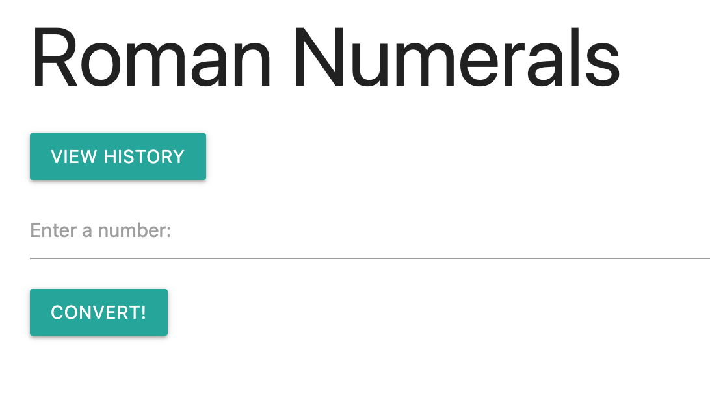

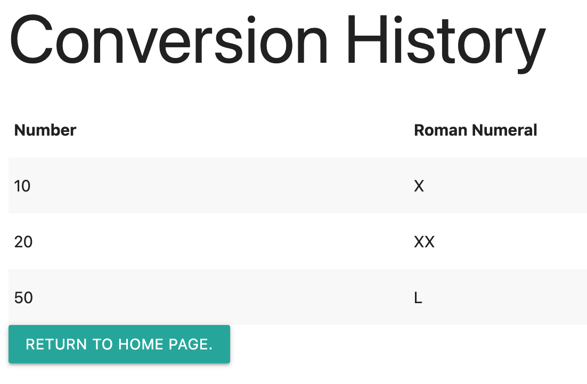


## Gemini CLI Non-interactive Mode


When running Gemini CLI in a non-interactive mode within a CI/CD pipeline, you can automate various tasks by passing prompts and commands directly to the CLI without requiring manual intervention. This allows for seamless integration into automated workflows for code analysis, documentation generation, and other development tasks.

Quit the Gemini CLI using the `/quit` command:

```bash
/quit
```
In the system terminal type:

```bash
gemini -p "Explain the architecture of this codebase"
```

Review the output.

Get back into Gemini CLI for proceeding with the lab:

```bash
gemini
```

By leveraging Gemini CLI in non-interactive mode, you can significantly enhance the automation capabilities of your CI/CD pipelines, leading to more efficient development cycles and improved code quality.


## Gemini CLI Shell Mode


While LLMs handle complex tasks, direct commands are more efficient for straightforward actions. The `! prefix` allows seamless switching between AI and traditional command-line interfaces.

```
! ls
```

If the copy command doesn't work, just click on the Gemini CLI and type `!`. The prompt changes to the shell mode. Review the output. Hit `Escape` to exit shell mode.


## Gemini CLI MCP support


Gemini CLI, through the Model Context Protocol (MCP), can integrate with GCP native services like Cloud Run or third-party systems like Jira, Confluence or GitHub. This is achieved via MCP server custom tool integrations, allowing Gemini CLI to e.g. deploy an app to Cloud Run, create or update JIRA tickets, fetch information from Confluence pages, create pull requests, etc.
This requires the file `settings.json` to be present in the `.gemini` subdirectory in the current folder hierarchy.

We'll be adding two MCP servers for this lab. One for documentation with `Context7` and another for deploying apps to `Cloud Run`.
Quit Gemini CLI using the `/quit` command and run the following command in the terminal to create the configuration file:
```
echo '{
    "mcpServers": {
        "context7": {
            "httpUrl": "https://mcp.context7.com/mcp"
        },
        "cloud-run": {
            "command": "npx",
            "args": ["-y", "@google-cloud/cloud-run-mcp"]
          }
    }
}' > .gemini/settings.json
```

Start the Gemini CLI session:

```bash
gemini
```

Verify configured MCP servers:

```bash
/mcp
```

Review the output

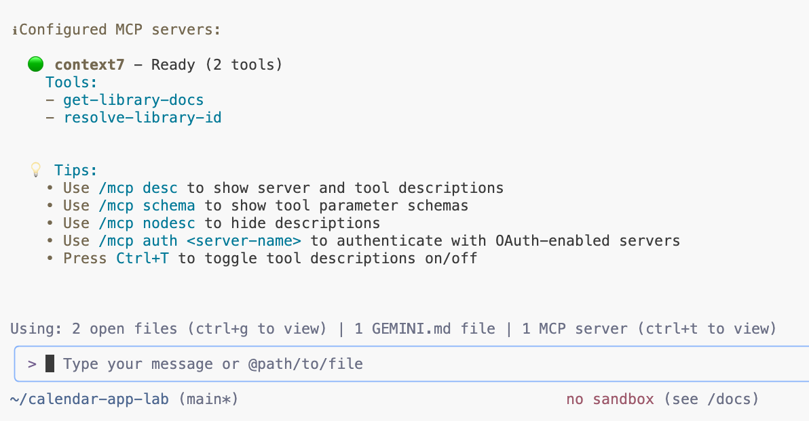

Send the prompt to test the `context7` configured MCP server:

```bash
use context7 tools to look up how to implement flex grid in react mui library 
```

Approve the tools and review the output.

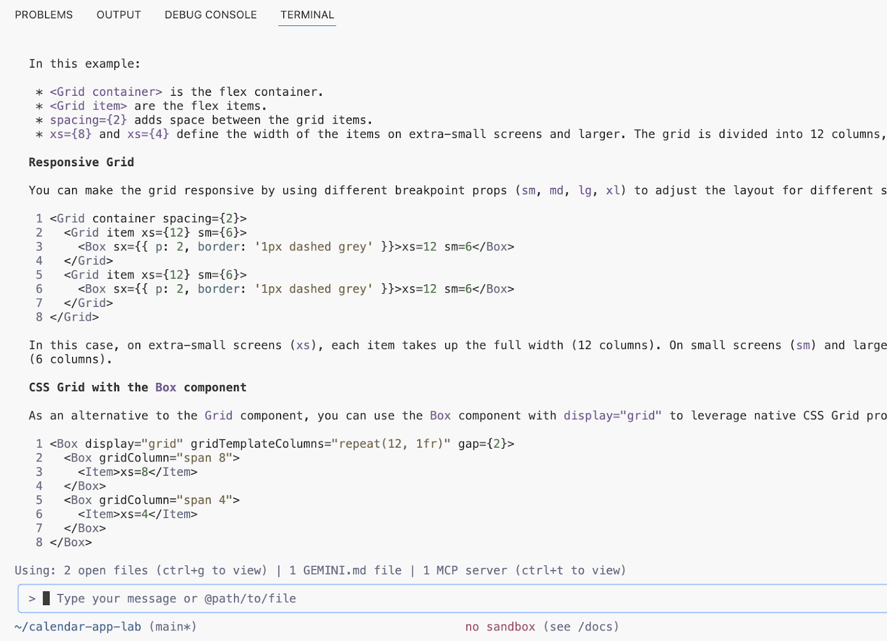


## Gemini CLI Conclusion


In conclusion, Gemini CLI stands out as a powerful and versatile open-source AI agent that seamlessly integrates with Google Cloud's Gemini models, significantly enhancing developer productivity. Throughout this lab, we've explored its capabilities in streamlining various common development tasks, from understanding complex codebases and generating essential documentation and unit tests to efficiently refactoring both frontend and backend components of a Python web application. By leveraging Gemini CLI, developers can reduce context switching, automate repetitive processes, and ultimately deliver higher-quality code with greater efficiency. Its ability to bring the power of generative AI directly to the command line truly revolutionizes the development workflow.


## Congratulations!


Congratulations, you finished the codelab!

### What we've covered:

* Using Gemini CLI for common developer tasks

### What's next:

* More hands-on sessions are coming!

©2025 Google LLC All rights reserved. Google and the Google logo are trademarks of Google LLC. All other company and product names may be trademarks of the respective companies with which they are associated.

