# Accelerating Development with Gemini CLI


## Overview


This lab focuses on utilizing Gemini CLI, an open-source AI-powered agent in Google Cloud. You will learn to use Gemini CLI for various tasks, including understanding existing codebases, generating documentation and unit tests, refactoring both UI and backend components of a Python web application.

### What you will learn

In this lab, you will learn how to do the following:

* How to use Gemini CLI for common developer tasks.

### Prerequisites

* This lab assumes familiarity with the Cloud Console and Cloud Shell environments. 


## Setup and Requirements


### Cloud Project setup

1. Sign-in to the  [Google Cloud Console](http://console.cloud.google.com) and create a new project or reuse an existing one. If you don't already have a Gmail or Google Workspace account, you must  [create one](https://accounts.google.com/SignUp).


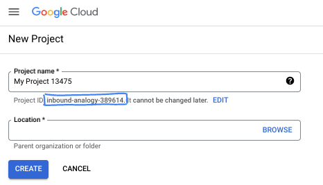

* The **Project name** is the display name for this project's participants. It is a character string not used by Google APIs. You can always update it.
* The **Project ID** is unique across all Google Cloud projects and is immutable (cannot be changed after it has been set). The Cloud Console auto-generates a unique string; usually you don't care what it is. In most codelabs, you'll need to reference your Project ID (typically identified as `PROJECT_ID`). If you don't like the generated ID, you might generate another random one. Alternatively, you can try your own, and see if it's available. It can't be changed after this step and remains for the duration of the project.
* For your information, there is a third value, a **Project Number**, which some APIs use. Learn more about all three of these values in the  [documentation](https://cloud.google.com/resource-manager/docs/creating-managing-projects#before_you_begin).

> aside negative
> 
> **Caution:** A project ID is globally unique and can't be used by anyone else after you've selected it. You are the only user of that ID. Even if a project is deleted, the ID can't be used again

> aside positive
> 
> **Note:** If you use a Gmail account, you can leave the default location set to **No organization**. If you use a Google Workspace account, choose a location that makes sense for your organization.

2. Next, you'll need to  [enable billing](https://console.cloud.google.com/billing) in the Cloud Console to use Cloud resources/APIs. Running through this codelab won't cost much, if anything at all. To shut down resources to avoid incurring billing beyond this tutorial, you can delete the resources you created or delete the project. New Google Cloud users are eligible for the  [$300 USD Free Trial](http://cloud.google.com/free) program.

### Environment Setup

Open Gemini chat.

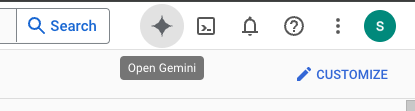

Or type "Ask Gemini" in the search bar.

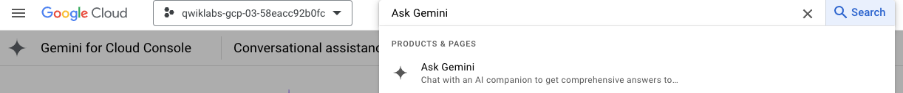

Enable Gemini for Google Cloud API:

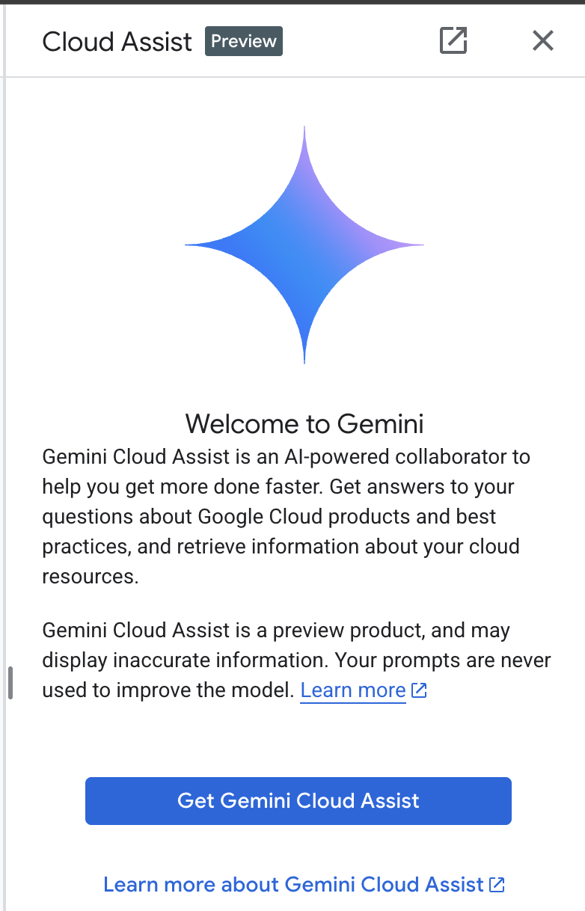

Enable GCA on the next screen.

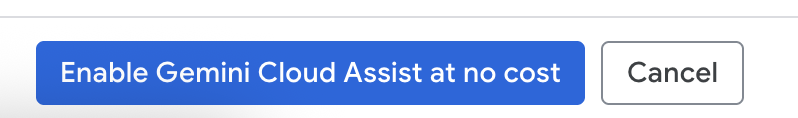

Click "`Start chatting`" and follow one of the sample questions or type your own prompt to try it out.

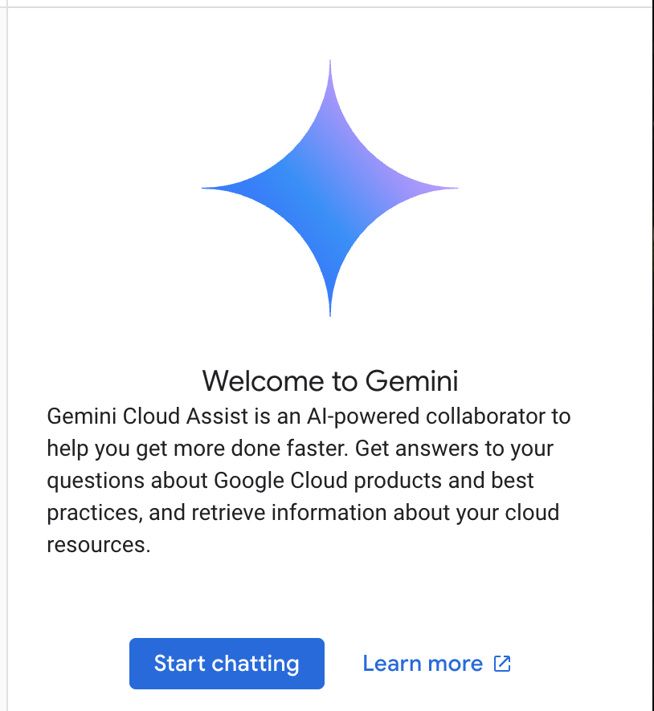


Prompts to try:

* Explain Cloud Run in 5 key points.
* You are Google Cloud Run Product Manager, explain Cloud Run to a student in 5 short key points.
* You are Google Cloud Run Product Manager, explain Cloud Run to a Certified Kubernetes Developer in 5 short key points.
* You are Google Cloud Run Product Manager, explain when you would use Cloud Run versus GKE to a Senior Developer in 5 short key points.

Close the Gemini Cloud Assist chat window after you are done.

Check out  [Prompt Guide](https://cloud.google.com/gemini/docs/discover/write-prompts) to learn more about writing better prompts.

### How Gemini for Google Cloud uses your data 

#### Google's privacy commitment

Google was one of the first in the industry to publish an  [AI/ML privacy commitment](https://cloud.google.com/blog/products/ai-machine-learning/google-cloud-unveils-ai-and-ml-privacy-commitment), which outlines our belief that customers should have the **highest level of security and control over their data** that's stored in the cloud.

#### Data you submit and receive

The questions that you ask Gemini, including any input information or code that you submit to Gemini to analyze or complete, are called prompts. The answers or code completions that you receive from Gemini are called responses. **Gemini doesn't use your prompts or its responses as data to train its models**.

#### Encryption of prompts

When you submit prompts to Gemini, **your data is encrypted** in-transit as input to the underlying model in Gemini.

#### Program data generated from Gemini

Gemini is trained on first-party Google Cloud code as well as selected third-party code. **You're responsible for the security, testing, and effectiveness of your code**, including any code completion, generation, or analysis that Gemini offers you.

[Learn more](https://cloud.google.com/gemini/docs/discover/data-governance) how Google handles your prompts.


## Options to test prompts


If you would like to change existing prompts, you have several options for that.

*  [Vertex AI Studio](https://console.cloud.google.com/vertex-ai/generative/language/create/chat?createType=codechat) 

Vertex AI Studio is a part of Google Cloud's Vertex AI platform, specifically designed to simplify and accelerate the development and use of generative AI models.

*  [Google AI Studio](https://aistudio.google.com/) 

Google AI Studio is a web-based tool for prototyping and experimenting with prompt engineering and the Gemini API. 

*  [Gemini Web App](https://gemini.google.com/) (gemini.google.com)

The Google Gemini web app (gemini.google.com) is a web-based tool designed to help you explore and utilize the power of Google's Gemini AI models.

* Google Gemini mobile app for  [Android](https://play.google.com/store/apps/details?id=com.google.android.apps.bard&utm_source=keyword_blog&utm_medium=owned&utm_campaign=blog_gem_24q1) and  [Google app on iOS](https://apps.apple.com/us/app/google/id284815942?ppid=cdfe7851-5436-45cf-9eb8-60dd08f22ead&pt=9008&mt=8&ct=oo-pmm-web-gem-24q1blog)


## Download and examine the application


Activate Cloud Shell by clicking on the icon to the right of the search bar.

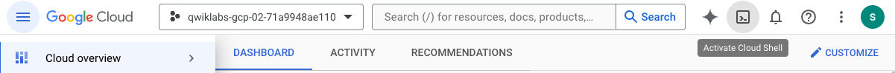

 If prompted to authorize, click "Authorize" to continue.


In the terminal, run the commands below to clone the Git repository locally.

```
git clone https://github.com/gitrey/calendar-app-lab
cd calendar-app-lab
```

Start "Cloud Shell Editor".


Open the "`calendar-app-lab`" folder.

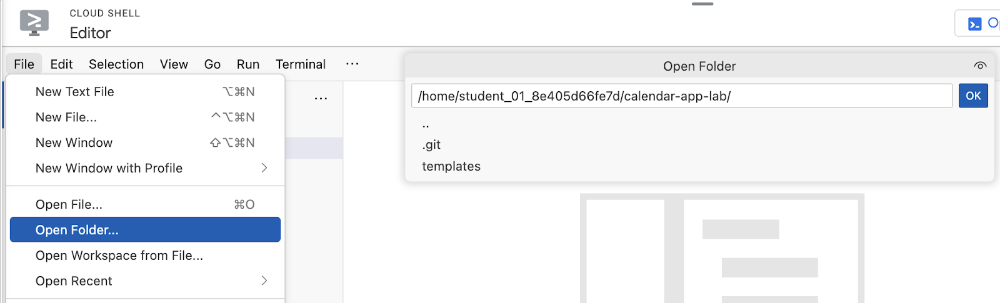

Start a new terminal in the Cloud Shell Editor.


Your environment should look similar to the screenshot below.


## Gemini CLI Introduction


[Gemini CLI](https://github.com/google-gemini/gemini-cli/tree/main?tab=readme-ov-file#gemini-cli) is an open-source AI agent that integrates with Google Cloud's Gemini models. It allows developers to perform various tasks directly from their terminal, such as understanding codebases, generating documentation and unit tests, and refactoring code. The key benefit of Gemini CLI is its ability to streamline development workflows by bringing the power of generative AI directly into the developer's command-line environment, reducing context switching and enhancing productivity.

This step, to set the environment variable, is not required for the Qwiklabs environment. Continue with the next step.

In your local environment, if you are using a paid Code Assist License from your organization, remember to set the Google Cloud Project in your terminal.  [More details](https://github.com/google-gemini/gemini-cli?tab=readme-ov-file#option-1-login-with-google-oauth-login-using-your-google-account).

```
export GOOGLE_CLOUD_PROJECT="YOUR_PROJECT_NAME"
```

Check that you are in the root of the project folder:

```
cd ~/calendar-app-lab
```

Start Gemini CLI in the terminal window:

```
gemini
```

Your environment should look similar to the screenshot below.

If you are following the steps in your local environment, you can enable integration with your IDE. 

You can always change this by running `/ide disable | enable`.


If you are running the lab in the Qwiklabs environment, select "`Use Cloud Shell user credentials`".

Otherwise authenticate Gemini CLI by running following command and select "`Login with Google`":

```
/auth
```

After restarting the CLI, you will be prompted to authorize the application by following a provided link.

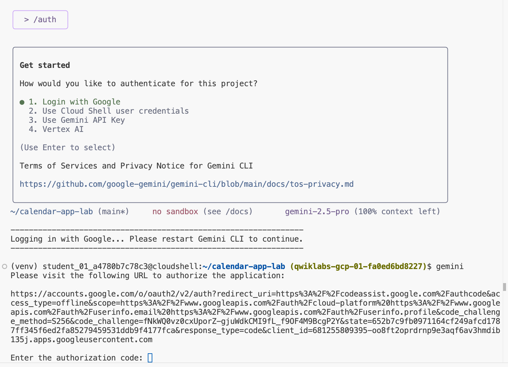

Open the link and follow the steps to sign-in with your Qwiklabs student's credentials. 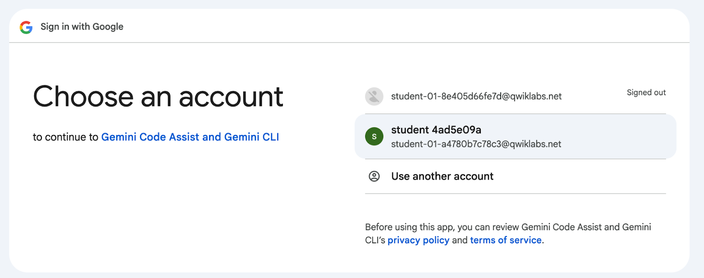

Copy verification code and return to the terminal to complete the process by pasting the code.

To verify your Auth method, run following command:

```
/about
```


## Codebase understanding


You can use the Gemini CLI to quickly gain codebase understanding by asking it to summarize the purpose of files or directories and explain complex functions or sections of code. This allows developers to rapidly onboard to new projects or grasp unfamiliar parts of existing code without deep manual exploration.

To learn more about the codebase, send the following prompt in the Gemini CLI:

```
Don't suggest any changes. Explain this codebase to me.
```

Review the output:


## Start the application locally


The Gemini CLI can significantly simplify running your Python application locally by helping you auto-generate essential configuration files like requirements.txt or a basic Dockerfile. Moreover, it's excellent for managing Python dependencies and troubleshooting, as it can quickly explain traceback errors resulting from missing packages or version conflicts, and often suggest the precise pip install command to fix the issue.

To launch the application locally, enter the following prompt in the Gemini CLI terminal:

```
Run this app locally
```

Follow the prompts to get application started:


Click on the link to preview application:


Sample output:


## Adding documentation


The Gemini CLI is effective for documentation and commenting by allowing you to instantly generate docstrings for functions or classes. You can also leverage it to quickly add explanatory inline comments to complex or unfamiliar code blocks, significantly improving the codebase's clarity and maintainability.

To add comments to every Python file in the application, use the Gemini CLI terminal and enter the following prompt:

```
Add docstrings to all files
```

Approve the changes that have been suggested. If IDE integration is enabled, you can accept and proceed by using the UI controls or pressing Enter in the terminal. You can also enable auto-approve(YOLO) mode with "`ctrl+y`".


Update the `.gitignore` file with the following prompt:

```
update .gitignore and add __pycache__ folder
```

Switch to Source Control view and review changes that you made so far:


## Adding Unit Tests


The Gemini CLI is excellent for writing unit tests by enabling developers to generate test functions based on an existing function's signature and logic, complete with initial assertions and mock setup, developers must still review and validate the generated tests to ensure they meaningfully cover all required edge cases and not just simplistic path execution.

Using the prompt below, to generate unit tests:

```
Generate unit tests for @calendar.py
```

Accept the changes after reviewing them.


Install new dependencies and run the tests. The Gemini CLI will observe, fix, and re-run the generated code in a loop until tests pass and the code is validated.


## Check for bugs


The Gemini CLI can assist in checking for bugs in the logic by enabling you to prompt it to review and analyze code snippets, identifying potential logical flaws, off-by-one errors, or incorrect conditional handling. By explaining the code's intended behavior and asking the CLI to spot discrepancies, you can quickly catch subtle defects before running the code.

To check for any bugs in conversion logic, send the following prompt in Gemini CLI:

```
Are there any bugs in the conversion logic? Check if negative numbers are handled properly.
```

Review suggested changes and accept them in the chat:


## Refactor UI


The Gemini CLI can significantly aid in UI refactoring by helping you translate older UI patterns (like class components) into newer, more modern functional paradigms (like hooks in React) or suggest structural improvements for better maintainability. You can use it to analyze and refactor existing UI code into more modular, reusable components, ensuring a cleaner and more standardized interface design.

Refactor the UI using the Bootstrap library by submitting the following prompt to the Gemini CLI:

```
Refactor UI to use Bootstrap library
```

Review and accept the changes:


To begin, launch the application. If it's already running, simply reload the page.

```
python3 main.py
```

Reload the page  and check the changes.


Implement error handling to ensure an error page is displayed when issues arise.

```
Implement error handling to display an error page when issues occur.
```

Please refresh the page to view the updates.

Send a negative number to confirm the error page.


## Refactor Backend


The Gemini CLI is effective for backend refactoring by assisting in the migration of legacy framework code to modern alternatives or helping restructure monolithic services into more manageable microservice components. It can analyze server-side logic to suggest improved database query patterns or more efficient API endpoint designs, ensuring performance and scalability are maintained or enhanced.

Modify the backend to save conversion requests in memory.

```
Store requests in memory and create a page to display conversion history. Add links on all pages to view the history.
```

Review and accept the changes in the chat:


Submit several requests to the application, then review history page.


Review the history of conversion requests.


To update the README.md file with the current codebase state, send this prompt via Gemini CLI:

```
analyze README.md file and update it with latest codebase state
```

Review the output. If you enabled Cloud Shell integration, you can use UI control to access the changes or you can do it from the terminal.


## Gemini CLI Built-in Tools


The Gemini CLI includes built-in tools that the Gemini model uses to interact with your local environment, access information, and perform actions. These tools enhance the CLI's capabilities, enabling it to go beyond text generation and assist with a wide range of tasks.

Send this prompt in Gemini CLI to view the available tools:

```
/tools
```

Review the output.


Gemini CLI intelligently selects the most appropriate built-in tools based on the task you provide, allowing it to execute complex operations by leveraging its understanding of your request and the available functionalities.  [Learn more about the built-in tools](https://github.com/google-gemini/gemini-cli/blob/main/docs/tools/index.md#learn-more-about-gemini-clis-tools).


## Gemini CLI Repo Init Command


The Gemini CLI includes a command to analyze the project and create a tailored GEMINI.md file.

To generate the **GEMINI.md** file, send the following prompt using the Gemini CLI:

```
/init
```

Review the output. This command will create a GEMINI.md file, which summarizes the project's purpose, technologies, build/run instructions, and development conventions for future context.

To understand what instructions or context to include in your project's `GEMINI.md` file, a good starting point is to review the GEMINI.md file found in the `gemini-cli`  [repository](https://github.com/google-gemini/gemini-cli/blob/main/GEMINI.md#avoiding-any-types-and-type-assertions-preferring-unknown).


## Gemini CLI Custom Commands


You can streamline your development workflow and maintain consistency by using custom commands in Gemini CLI. These commands act as personal shortcuts for your most-used prompts. You have the flexibility to create commands that are specific to a single project or make them globally available across all your projects.

The repository comes with several custom commands located in the `.gemini/commands` folder.

### Custom Command To Create a Diagram

Send this prompt in Gemini CLI to generate a request flow diagram in Mermaid format.

Accept tools calls, like creating a folder and saving a file.

```
/diagram:new request flow for this app
```

Review the output.


If you want to preview the diagram, install `Mermaid Chart` extension from the Marketplace.


Open the file and select preview from the context menu.


### Custom Command To Create a Deck

Send this prompt in Gemini CLI to generate a deck with key points in Marp format.

Accept tools calls, like creating a folder and saving a file.

```
/deck:new key points and details for this app
```

Review the output.

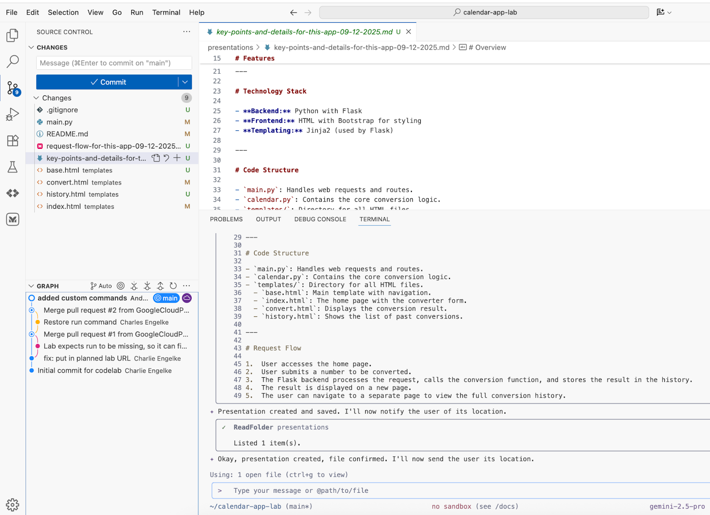

This step is not compatible with Cloud Shell, as the Marp extension requires a Web browser installation.

Install Marp for VS Code extension from the Marketplace to save the deck.

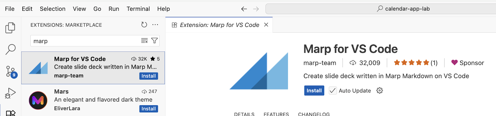

Otherwise you would open the generated file in the editor and from the command palette select "`Marp: Export Slide Deck`".

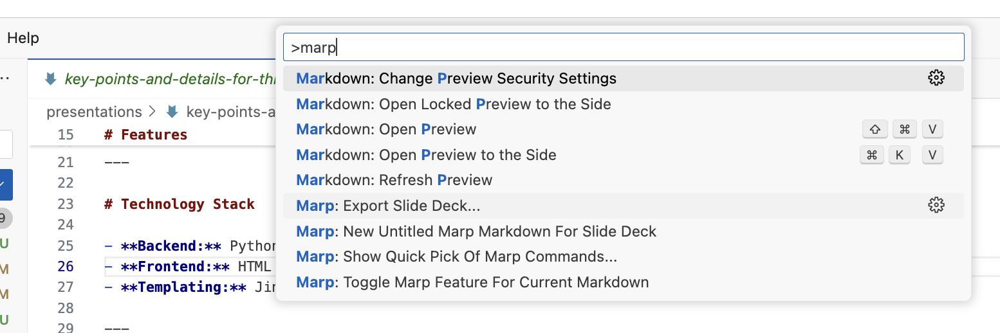

### Custom Command To Plan New Feature Implementation

Send this prompt in Gemini CLI to refactor UI.

Accept tools calls, like creating a folder and saving a file.

```
/plan:new refactor UI to use Materialize CSS
```

Review the output.


Initiate the UI refactoring process by submitting this prompt through the Gemini CLI, based on the previously generated plan.

Accept tools calls, like creating a folder and saving a file. You can enable tools auto-approve mode(`YOLO mode`) by using "`ctrl+y`".

```
/plan:impl implement the plan to refactor the app
```


Start/reload the application and review the output:


## Gemini CLI Non-interactive Mode


When running Gemini CLI in a non-interactive mode within a CI/CD pipeline, you can automate various tasks by passing prompts and commands directly to the CLI without requiring manual intervention. This allows for seamless integration into automated workflows for code analysis, documentation generation, and other development tasks.

Open a new terminal or close the existing Gemini CLI session and run this command.

```
gemini -p "Explain the architecture of this codebase"
```

Review the output.

If your task will require approval of tools, you could enable YOLO mode with the `-y` flag.

```
gemini -p "Explain the architecture of this codebase and save the file in the markdown format in the docs folder" -y
```

Review the output.

By leveraging Gemini CLI in non-interactive mode, you can significantly enhance the automation capabilities of your CI/CD pipelines, leading to more efficient development cycles and improved code quality.


## Gemini CLI Shell Mode


While LLMs handle complex tasks, direct commands are more efficient for straightforward actions. The `! prefix` allows seamless switching between AI and traditional command-line interfaces.

```
!ls
```

Review the output. Hit `Escape` to exit shell mode.


## Gemini CLI MCP support


Gemini CLI, through the Model Context Protocol (MCP), can integrate with third-party systems like Jira, Confluence or GitHub. This is achieved via MCP server custom tool integrations, allowing Gemini CLI to create or update JIRA tickets, fetch information from Confluence pages, create pull requests, etc. 

Run this command in the terminal to create the configuration file or use shell mode.

```
echo '{
    "mcpServers": {
        "context7": {
            "httpUrl": "https://mcp.context7.com/mcp"
        }
    }
}' > .gemini/settings.json
```

Start Gemini CLI session:

```
gemini
```

Verify configured MCP servers:

```
/mcp
```

Review the output


Send the prompt to test configured MCP server:

```
use context7 tools to look up how to implement flex grid in react mui library 
```

Approve the tools and review the output.


## Example MCP servers configuration for your local environment


You can configure multiple MCP servers in your local environment using the following config.

```
{
    "mcpServers": {
        "Snyk Security Scanner": {
            "command": "snyk",
            "args": [
                "mcp",
                "-t",
                "stdio",
                "--experimental"
            ],
            "env": {}
        },
        "atlassian": {
            "command": "npx",
            "args": [
                "-y",
                "mcp-remote",
                "https://mcp.atlassian.com/v1/sse"
            ]
        },
        "playwright": {
            "command": "npx",
            "args": [
                "@playwright/mcp@latest"
            ]
        },
        "github": {
            "command": "npx",
            "args": [
                "-y",
                "@modelcontextprotocol/server-github"
            ],
            "env": {
                "GITHUB_PERSONAL_ACCESS_TOKEN": "******"
            }
        }
    }
}
```

The MCP servers in this configuration transform your Gemini CLI agent into a dynamic development and collaboration tool by providing standardized access to external systems. Specifically, the Snyk Security Scanner server allows the agent to check code and dependencies for vulnerabilities without leaving your current workspace, while the Atlassian server connects to Jira and Confluence, enabling the Gemini CLI to create, search, and update issues or documentation using natural language. Furthermore, the Playwright server grants the agent browser automation capabilities, allowing it to navigate and interact with the web for tasks like testing or data extraction. Finally, the Github server gives the agent direct, contextual access to your repositories, allowing it to manage PRs, triage issues, and analyze the codebase, significantly reducing context switching and boosting productivity across your entire development workflow.


## Gemini CLI Conclusion


In conclusion, Gemini CLI stands out as a powerful and versatile open-source AI agent that seamlessly integrates with Google Cloud's Gemini models, significantly enhancing developer productivity. Throughout this lab, we've explored its capabilities in streamlining various common development tasks, from understanding complex codebases and generating essential documentation and unit tests to efficiently refactoring both frontend and backend components of a Python web application. By leveraging Gemini CLI, developers can reduce context switching, automate repetitive processes, and ultimately deliver higher-quality code with greater efficiency. Its ability to bring the power of generative AI directly to the command line truly revolutionizes the development workflow.


## Congratulations!


Congratulations, you finished the codelab!

### What we've covered:

* Using Gemini CLI for common developer tasks

### What's next:

* More hands-on sessions are coming!

### Clean up

To avoid incurring charges to your Google Cloud account for the resources used in this tutorial, either delete the project that contains the resources, or keep the project and delete the individual resources.

### Deleting the project

The easiest way to eliminate billing is to delete the project that you created for the tutorial.

©2025 Google LLC All rights reserved. Google and the Google logo are trademarks of Google LLC. All other company and product names may be trademarks of the respective companies with which they are associated.

