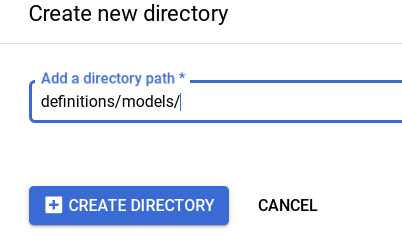
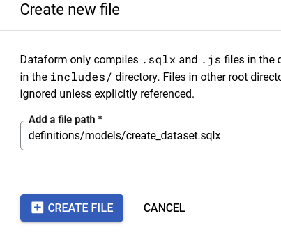

## Lab 3: Dataform

<walkthrough-tutorial-duration duration="45"></walkthrough-tutorial-duration>
<walkthrough-tutorial-difficulty difficulty="3"></walkthrough-tutorial-difficulty>
<bootkon-cloud-shell-note/>

During this lab, you gather user feedback to assess the impact of model adjustments on real-world use (prediction), ensuring that our fraud detection system effectively balances accuracy with user satisfaction. 
* Use Dataform , BigQuery and Gemini to Perform sentiment analysis of customer feedback.
### Dataform 

Dataform is a fully managed service that helps data teams build, version control, and orchestrate SQL workflows in BigQuery. It provides an end-to-end experience for data transformation, including:

* Table definition: Dataform provides a central repository for managing table definitions, column descriptions, and data quality assertions. This makes it easy to keep track of your data schema and ensure that your data is consistent and reliable.  
* Dependency management: Dataform automatically manages the dependencies between your tables, ensuring that they are always processed in the correct order. This simplifies the development and maintenance of complex data pipelines.  
* Orchestration: Dataform orchestrates the execution of your SQL workflows, taking care of all the operational overhead. This frees you up to focus on developing and refining your data pipelines.

Dataform is built on top of Dataform Core, an open source SQL-based language for managing data transformations. Dataform Core provides a variety of features that make it easy to develop and maintain data pipelines, including:

* Incremental updates: Dataform Core can incrementally update your tables, only processing the data that has changed since the last update. 
* Slowly changing dimensions: Dataform Core provides built-in support for slowly changing dimensions, which are a common type of data in data warehouses.   
* Reusable code: Dataform Core allows you to write reusable code in JavaScript, which can be used to implement complex data transformations and workflows.

Dataform is integrated with a variety of other Google Cloud services, including GitHub, GitLab, Cloud Composer, and Workflows. This makes it easy to integrate Dataform with your existing development and orchestration workflows.  

### Use Cases for Dataform

Dataform can be used for a variety of use cases, including:

* Data Warehousing: Dataform can be used to build and maintain data warehouses that are scalable and reliable.  
* Data Engineering: Dataform can be used to develop and maintain data pipelines that transform and load data into data warehouses.  
* Data Analytics: Dataform can be used to develop and maintain data pipelines that prepare data for analysis.  
* Machine Learning: Dataform can be used to develop and maintain data pipelines that prepare data for machine learning models.

***

### Create a Dataform Pipeline

First step in implementing a pipeline in Dataform is to set up a repository and a development environment. Detailed quickstart and instructions can be found [here](https://cloud.google.com/dataform/docs/quickstart-create-workflow).

### Create a Repository in Dataform

Go to [Dataform](https://console.cloud.google.com/bigquery/dataform) (part of the BigQuery console).

1. Click on <walkthrough-spotlight-pointer locator="css(a[id$=create-repository])">+ CREATE REPOSITORY</walkthrough-spotlight-pointer>

2. Use the following values when creating the repository:

    Repository ID: `hackathon-repository` \
    Region: `us-central1` \
    Service Account: `Default Dataform service account`

3. And click on <walkthrough-spotlight-pointer locator="text('create')">CREATE</walkthrough-spotlight-pointer>



The dataform service account you see on your screen should be `{{ DATAFORM_SA }}`. We will need it later.


Next, click <walkthrough-spotlight-pointer locator="text('go to repositories')">GO TO REPOSITORIES</walkthrough-spotlight-pointer>, and then choose the <walkthrough-spotlight-pointer locator="text('hackathon-repository')">hackathon-repository</walkthrough-spotlight-pointer> you just created.


### Create a Dataform Workspace

You should now be in the <walkthrough-spotlight-pointer locator="text('development workspaces')">Development workspaces</walkthrough-spotlight-pointer> tab of the hackathon-repository page.

First, click <walkthrough-spotlight-pointer locator="text('create development workspace')">Create development workspace</walkthrough-spotlight-pointer> to create a copy of your own repository.  You can create, edit, or delete content in your repository without affecting others.


In the **Create development workspace** window, do the following:  
   1. In the <walkthrough-spotlight-pointer locator="semantic({textbox 'Workspace ID'})">Workspace ID</walkthrough-spotlight-pointer> field, enter `hackathon-{{ MY_NAME | lower }}-workspace` or any other name you like.

   2. Click <walkthrough-spotlight-pointer locator="text('create')">CREATE</walkthrough-spotlight-pointer>
   3. The development workspace page appears.  
   4. Click on the newly created `hackathon-{{ MY_NAME | lower }}-workspace` 
   5. Click <walkthrough-spotlight-pointer locator="css(button[id$=initialize-workspace-button])">Initialize workspace</walkthrough-spotlight-pointer>

### Adjust workflow settings

We will now set up our custom workflow.

1. Edit the `workflow_settings.yaml`file :

2. Replace `defaultDataset` value with ``ml_datasets``

3. Make sure `defaultProject` value is ``{{ PROJECT_ID }}``

4. Click on <walkthrough-spotlight-pointer locator="text('install packages')">INSTALL PACKAGES</walkthrough-spotlight-pointer> ***only once***. You should see a message at the bottom of the page:

    *Package installation succeeded*


Next, let's create several workflow files.

1. Delete the following files from the <walkthrough-spotlight-pointer locator="semantic({treeitem 'Toggle node *definitions more'})">*definitions</walkthrough-spotlight-pointer> folder:

    `first_view.sqlx`
    `second_view.sqlx`

2. Within <walkthrough-spotlight-pointer locator="semantic({treeitem 'Toggle node *definitions more'})">*definitions</walkthrough-spotlight-pointer> create a new directory called `models`:



3. Click on `models` directory and create 2 new files

      ```
      create_dataset.sqlx
      ```
      ```
      llm_model_connection.sqlx
      ```

    Example:



4. Copy the contents to each of those files:

    <walkthrough-editor-open-file filePath="src/dataform/definitions/models/create_dataset.sqlx">`create_dataset`</walkthrough-editor-open-file>

    <walkthrough-editor-open-file filePath="src/dataform/definitions/models/llm_model_connection.sqlx">`llm_model_connection`</walkthrough-editor-open-file>

5. Click on <walkthrough-spotlight-pointer locator="semantic({treeitem 'Toggle node *definitions more'})">*definitions</walkthrough-spotlight-pointer> and create 3 new files: 

    ```
    mview_ulb_fraud_detection.sqlx
    ```
    ```
    sentiment_inference.sqlx
    ```
    ```
    ulb_fraud_detection.sqlx
    ```

  Example:

 

6. Copy the contents to each of those files:

    <walkthrough-editor-open-file filePath="src/dataform/definitions/mview_ulb_fraud_detection.sqlx">`mview_ulb_fraud_detection`</walkthrough-editor-open-file>

    <walkthrough-editor-open-file filePath="src/dataform/definitions/sentiment_inference.sqlx">`sentiment_inference`</walkthrough-editor-open-file>

    <walkthrough-editor-open-file filePath="src/dataform/definitions/ulb_fraud_detection.sqlx">`ulb_fraud_detection`</walkthrough-editor-open-file>


7. Set the `database` value to your project ID ``{{ PROJECT_ID }}`` value in `ulb_fraud_detection.sqlx` file:


8. In `llm_model_connection.sql`, replace the `us.llm-connection` connection with the connection name you have created in LAB 2 during the BigLake section.  If you have followed the steps in LAB 2, the connected name should be `us.fraud-transactions-conn`

Notice the usage of `$ref` in line 11, of **definitions/mview\_ulb\_fraud\_detection.sqlx**. The advantages of using `$ref` in Dataform are

* Automatic Reference Management: Ensures correct fully-qualified names for tables and views, avoiding hardcoding and simplifying environment configuration.  
* Dependency Tracking: Builds a dependency graph, ensuring correct creation order and automatic updates when referenced tables change.  
* Enhanced Maintainability: Supports modular and reusable SQL scripts, making the codebase easier to maintain and less error-prone.

***

### **Execute Dataform workflows**

Run the dataset creation by **Tag**. Tag allow you to just execute parts of the workflows and not the entire workflow. 

1. Click on <walkthrough-spotlight-pointer locator="semantic({button 'Start execution'})">Start execution</walkthrough-spotlight-pointer> > <walkthrough-spotlight-pointer locator="text('tags')">Tags</walkthrough-spotlight-pointer> \> <walkthrough-spotlight-pointer locator="text('dataset_ulb_fraud_detection_llm')">dataset_ulb_fraud_detection_llm</walkthrough-spotlight-pointer><walkthrough-spotlight-pointer locator="semantic({button 'Start execution'})"> Start execution</walkthrough-spotlight-pointer>

2. Click on <walkthrough-spotlight-pointer locator="semantic({link 'Details'})">DETAILS</walkthrough-spotlight-pointer>

    Notice the Access Denied error on BigQuery for the dataform service account `{{ DATAFORM_SA }}`

3. Go to [IAM & Admin](https://console.cloud.google.com/iam-admin)

4. Click on <walkthrough-spotlight-pointer locator="semantic({button 'Grant access'})">GRANT ACCESS</walkthrough-spotlight-pointer> and grant `BigQuery Data Editor , BigQuery Job User and BigQuery Connection User` to the principal `{{ DATAFORM_SA }}`.

5. Click on <walkthrough-spotlight-pointer locator="semantic({button 'Save'})">SAVE</walkthrough-spotlight-pointer>

 

  Note: If you encounter a policy update screen, just click on update.

6. Go back to [Dataform](https://console.cloud.google.com/bigquery/dataform) within in BigQuery, and retry <walkthrough-spotlight-pointer locator="semantic({button 'Start execution'})">START EXECUTION</walkthrough-spotlight-pointer> > <walkthrough-spotlight-pointer locator="text('tags')">Tags</walkthrough-spotlight-pointer> \> <walkthrough-spotlight-pointer locator="text('dataset_ulb_fraud_detection_llm')">dataset_ulb_fraud_detection_llm</walkthrough-spotlight-pointer><walkthrough-spotlight-pointer locator="semantic({button 'Start execution'})"> START EXECUTION</walkthrough-spotlight-pointer>. \
Notice the execution status. It should be a success.  
 
7. Lastly, go to Compiled graph and explore it.
Go to [Dataform](https://console.cloud.google.com/bigquery/dataform)\> `hackathon-{{ MY_NAME | lower }}-workspace` \> <walkthrough-spotlight-pointer locator="semantic({tab 'Compiled graph tab'})">COMPILED GRAPH</walkthrough-spotlight-pointer>

***

### Execute the workspace workflow

For  the sentiment inference step to succeed, you need to grant the external connection service account the Vertex AI user privilege. More details can be found in this [link](https://cloud.google.com/bigquery/docs/generate-text-tutorial#grant-permissions). 

1. You can find the service account ID under [BigQuery Studio](https://console.cloud.google.com/bigquery) \> ``{{ PROJECT_ID }}`` \> <walkthrough-spotlight-pointer locator="semantic({treeitem 'External connections'})">External connections</walkthrough-spotlight-pointer> \> `fraud-transactions-conn`  
     
   

2. Take note of the service account and grant it the `Vertex AI User` role.   
 
     
3. Back in your Dataform workspace, click <walkthrough-spotlight-pointer locator="semantic({button 'Start execution'})"> START EXECUTION</walkthrough-spotlight-pointer> from the top menu, then <walkthrough-spotlight-pointer locator="semantic({menuitem 'Execute actions'})">Execute Actions</walkthrough-spotlight-pointer>
 
4. Click on <walkthrough-spotlight-pointer locator="semantic({radio 'All actions'})">ALL ACTIONS</walkthrough-spotlight-pointer> Tab followed by choosing <walkthrough-spotlight-pointer locator="semantic({button 'Start execution'})">START EXECUTION</walkthrough-spotlight-pointer>  
 
5. Check the execution status. It should be a success.  

6. Verify the new table `sentiment_inference` in the `ml_datasets` dataset in BigQuery and query the BigQuery table content (At this point you should be familiar with running BigQuery SQL)  
   
    ```
    SELECT distinct ml_generate_text_llm_result,
    prompt,
    Feedback
    FROM `ml_datasets.sentiment_inference` LIMIT 10;
    ```
   
**\[Max 2 minutes\]** Discuss the table results within your team group.

7. Before moving to the challenge section of the Lab, go back to the CODE section of the Dataform workspace. At the top of the “Files” section on the left, click <walkthrough-spotlight-pointer locator="css(button[id$=commit-button])">COMMIT X CHANGES</walkthrough-spotlight-pointer> (X should be about 7), add a commit message like, “Bootkon Lab 3”, then click <walkthrough-spotlight-pointer locator="semantic({button 'Commit all files'})">COMMIT ALL FILES</walkthrough-spotlight-pointer> and then <walkthrough-spotlight-pointer locator="semantic({button 'push to default'})">PUSH TO DEFAULT BRANCH</walkthrough-spotlight-pointer>

    You should now have the message: *Workspace is up to date*
 
***

### Challenge section: production, scheduling and automation

Automate and schedule the compilation and execution of the pipeline. This is done using release configurations and workflow configurations.

**Release Configurations:**  
Release configurations allow you to compile your pipeline code at specific intervals that suit your use case. You can define:

* Branch, Tag, or Commit SHA: Specify which version of your code to use.  
* Frequency: Set how often the compilation should occur, such as daily or weekly.  
* Compilation Overrides: Use settings for testing and development, such as running the pipeline in an isolated project or dataset/table.  
    
  Common practice includes setting up release configurations for both test and production environments. For more information, refer to the [release configuration documentation](https://cloud.google.com/dataform/docs/release-configurations).  
    
**Workflow Configurations**  
    
  To execute a pipeline based on your specifications and code structure, you need to set up a workflow configuration. This acts as a scheduler where you define:  
    
* Release Configuration: Choose the release configuration to use.  
* Frequency: Set how often the pipeline should run.  
* Actions to Execute: Specify what actions to perform during each run.

  The pipeline will run at the defined frequency using the compiled code from the specified release configuration. For more information, refer to the [workflow configurations documentation](https://cloud.google.com/dataform/docs/workflow-configurations).

**\[TASK\] Challenge : Take up to 10 minutes to Setup a Daily Frequency Execution of the Workflow**


***Goal:*** Set up a daily schedule to automate and execute the workflow you created.

* Automate and schedule the pipeline’s compilation and execution.  
* Define release configurations for one production environment (optionally: you can create another one for dev environment)  
* Set up workflow configurations to schedule pipeline execution (use dataform service account).  
* Set up a 3 minute frequency execution of the workflow you have created.  
     
     
Note: If you are stuck and cannot figure out how to proceed after a few minutes, ask your team captain.

### Success

🎉 Congratulations, {{ MY_NAME }}! 🚀

You've just finished the lab, and wow, what a ride!  You dove headfirst into the world of Dataform, BigQuery, and Gemini, building a sentiment analysis pipeline from scratch. Remember all those setup steps?  Repository, workspace, connections...it's a blur now, but you nailed it. 

Those pesky "Access Denied" errors?  Conquered.  The pipeline?  Purring like a data-driven kitten, churning out sentiment scores like nobody's business.  And the best part?  You automated the whole thing! Scheduled executions?  Check.  You're a data pipeline master.  Bring on the next challenge – you've got this! 🚀

